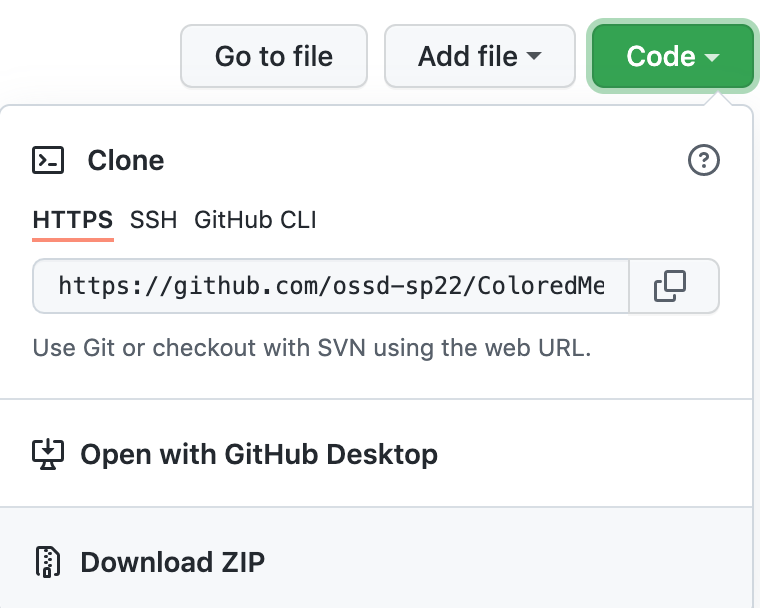

# ColorMeValentined
Team 9 Add-on Activity

This repository contains the code for our first github collaborative activity. We sought to create a Mozilla Firefox browser extension that changes a page's background color to match certain themes and moods, especially in light of Valentine's Day! <3

**To install this Extension:**
In order to install this extension you can either clone this repository to your local device (advanced) or locate the "Download Zip" button under the green "Code" option on this page (beginner).  Then unzip this to a known directory.

Once you know what folder these files are in, open Mozilla Firefox and type in "about:debugging#/runtime/this-firefox" in the Address Bar. Then click on "Temporary Add-On" and locate to this known folder and select any file there (but not a file in any sub-directory—to be sure, just pick the manifest.json file you see). 

Your extension should now have been loaded up. Navigate to any webpage and click on the heart icon in the top right corner of your screen. You should see a list of mood options pop up. Please pick one and enjoy the changing color on your screen!

If you have any concerns or feedback, please feel free to raise an issue!

Best,

Team 9
